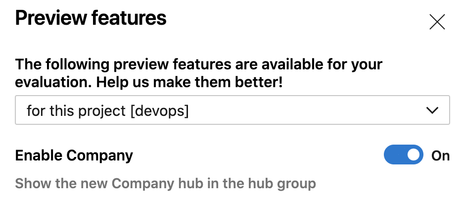
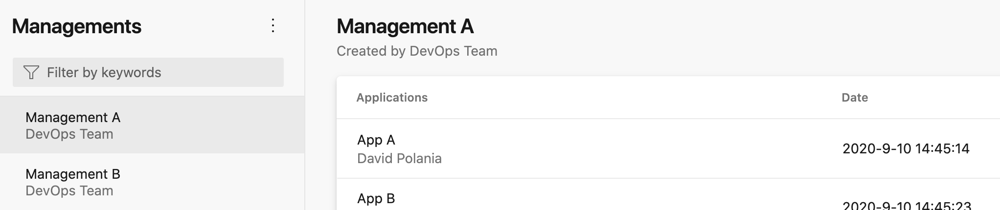

# Azure DevOps Company Extension

## About extension

This is an extension to manage the hierarchical structure of the organization and associate the components and applications to the managements in charge of managing

## result 

### Activate the extension

### a new icon appears in the main menu

## Start configuring the extension by entering the information

## Dependencies

The repository depends on a few Azure DevOps packages:

- [azure-devops-extension-sdk](https://github.com/Microsoft/azure-devops-extension-sdk): Required module for Azure DevOps extensions which allows communication between the host page and the extension iframe.
- [azure-devops-extension-api](https://github.com/Microsoft/azure-devops-extension-api): Contains REST client libraries for the various Azure DevOps feature areas.
- [azure-devops-ui](https://www.npmjs.com/package/azure-devops-ui): UI library containing the React components used in the Azure DevOps web UI.

Some external dependencies:
- `React` - Is used to render the UI in the samples, and is a dependency of `azure-devops-ui`.
- `SASS` - Extension samples are styled using SASS (which is compiled to CSS and delivered in webpack js bundles).
- `webpack` - Is used to gather dependencies into a single javascript bundle for each sample.

## Building the sample project

Just run:

    npm run build

This produces a .vsix file which can be uploaded to the [Visual Studio Marketplace](https://marketplace.visualstudio.com/azuredevops)

## Using the extension

The preferred way to get started is to use the `tfx extension init` command which will clone from this sample and prompt you for replacement information (like your publisher id). Just run:

    npm install -g tfx-cli
    tfx extension init

You can also clone the sample project and change the `publisher` property in `azure-devops-extension.json` to your own Marketplace publisher id. Refer to the online [documentation](https://docs.microsoft.com/en-us/azure/devops/extend/publish/overview?view=vsts) for setting up your own publisher and publishing an extension.

# References

The full set of documentation for developing extensions can be found at [https://docs.microsoft.com/en-us/azure/devops/extend](https://docs.microsoft.com/en-us/azure/devops/extend/?view=vsts).

# Contributing

This project welcomes contributions and suggestions.  Most contributions require you to agree to a
Contributor License Agreement (CLA) declaring that you have the right to, and actually do, grant us
the rights to use your contribution.

When you submit a pull request, a CLA-bot will automatically determine whether you need to provide
a CLA and decorate the PR appropriately (e.g., label, comment). Simply follow the instructions
provided by the bot. You will only need to do this once across all repos using our CLA.